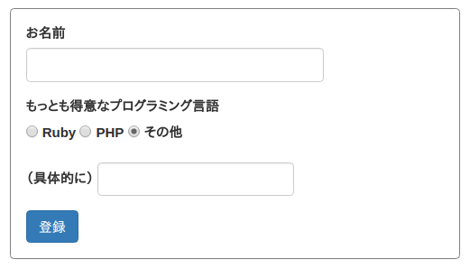

# Railsのフォームビルダーで生成したform要素をVueコンポーネント化する

## 要旨

* Vue.js は、サーバー側で生成された HTML 文書の一部をテンプレートとして利用できる。
* HTML フォームに含まれるフォーム要素（`input` 要素、`textarea` 要素、`select` 要素等）に `v-model` 属性を指定すれば、フォームへの入力と Vue コンポーネントのデータが結び付けられる。
* しかし、Vue.js はそれらの要素の `value`, `checked` または `selected` 属性の初期値を無視する。
* そこで、私はそれらの値を拾い上げて Vue コンポーネントのデータを初期化するプラグインを作成した。
* また、私はフォーム要素に設定された `name` 属性の値から適宜 `v-model` 属性に値をセットするように拡張されたフォームビルダーを作成し、Gem パッケージとして公開した。

## 背景

Rails のフォームビルダーで HTML フォームを生成し、jQuery で DOM 操作を行うという流儀で作られた Web アプリケーションはとても多く存在します。しかし、UI 仕様が複雑になってくると jQuery ベースでの開発は次第に困難になります。

次の図にあるような HTML フォームを例として考えてください。


ユーザーが「その他」と書かれたラジオボタンを選択すると、その下にテキストフィールドが現れます。



比較的単純な DOM 操作ではありますが、次の三つのことを実現するコードを jQuery を使って書かなければなりません。

1. ラジオボタンの選択状態を調べ、一番下のテキストフィールドの表示・非表示を切り替える関数 _f_ を定義する。
2. HTML 文書のロード時に関数 _f_ を呼び出す。
3. ユーザーがラジオボタンをクリックしたときに関数 _f_ を呼び出すようにする。

私は、これをかなり面倒だと考えています。

## Vue.js のテンプレート

Vue.js の特徴のひとつは、サーバー側で生成された HTML 文書の一部をテンプレートとして利用できる、ということです。

例えば、ある HTML 文書に次のような断片が含まれていたとします。

```html
<form class="new_user" id="user-form" action="/users" method="post">
  <input v-model="user.name" type="text" name="user[name]" id="user_name">
  <input type="submit" name="commit" value="Create">
</form>
```

このとき、次のような JavaScript コードを実行すれば、Vue.js はこの `<form>` 要素全体のコードをテンプレートとして解析し、Vue コンポーネント化した上で、この `<form>` 要素全体を再描画します。

```javascript
import Vue from "vue/dist/vue.esm"

document.addEventListener("DOMContentLoaded", () => {
  new Vue({
    el: "#user-form"
  })
})
```

`Vue` コンストラクタ関数の `el` オプションには CSS セレクタを指定し、これが Vue コンポーネントをマウントする対象を指します。ここでは `user-form` という `id` 属性を持つ要素が対象となります。

`Vue` コンストラクタ関数に `template` オプションが指定された場合、その値が Vue コンポーネントのテンプレートとなります。しかし、そうでない場合は、`el` オプションで指定された HTML 要素全体のコードがそのままテンプレートとして使われます。

Vue.js のテンプレートは、ブラウザや HTML パーサによってパースできる有効な HTML の断片です。

## `v-model` ディレクティブ

さて、さきほど例として挙げた HTML 文書に次のような記述があります。

```html
  <input v-model="user.name" type="text" name="user[name]" id="user_name">
```

HTML の標準に `v-model` という名前の属性はありません。`v-` で始まる属性は Vue.js で特殊な意味を持つ属性、すなわち**ディレクティブ**です。

`v-model` は、HTML フォームに含まれるフォーム要素（`input` 要素、`textarea` 要素、`select` 要素等）とVue コンポーネントのデータを結びつけます。この結びつきは双方向（two-way）です。ユーザーがフォーム要素の触れば、コンポーネントのデータが変化します。逆に、コンポーネントのデータが変化すれば、フォーム要素の状態も変化します。

ここで、ひとつ重要なことがあります。この**双方向データバインディング**を利用するためには、`Vue` コンストラクタ関数で `data` オプションを指定し、コンポーネントのデータを初期化する必要がある、ということです。つまり、さきほどの JavaScript コードを次のように書き換えなければなりません。

```javascript
document.addEventListener("DOMContentLoaded", () => {
  new Vue({
    el: "#user-form",
    data: {
      user: {
        name: ""
      }
    }
  })
})
```
