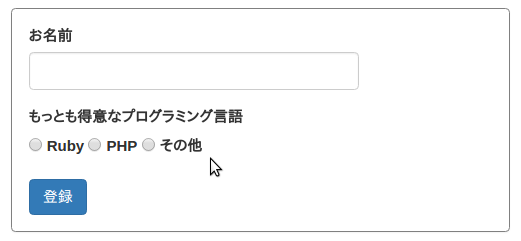

# Railsのフォームビルダーで生成したform要素をVueコンポーネント化する

## 要旨

* Vue.js は、サーバー側で生成された HTML 文書の一部をテンプレートとして利用できる。
* HTML フォームに含まれるフォーム要素（`input` 要素、`textarea` 要素、`select` 要素等）に `v-model` 属性を指定すれば、フォームへの入力と Vue コンポーネントのデータが結び付けられる。
* しかし、Vue.js はそれらの要素の `value`, `checked` または `selected` 属性の初期値を無視する。
* そこで、私はそれらの値を拾い上げて Vue コンポーネントのデータを初期化するプラグインを作成した。
* また、私はフォーム要素に設定された `name` 属性の値から適宜 `v-model` 属性に値をセットするように拡張されたフォームビルダーを作成し、Gem パッケージとして公開した。

## 背景

Rails のフォームビルダーで HTML フォームを生成し、jQuery で DOM 操作を行うという流儀で作られた Web アプリケーションはとても多く存在します。しかし、UI 仕様が複雑になってくると jQuery ベースでの開発は次第に困難になります。

次の図にあるような HTML フォームを例として考えてください。



ユーザーが「その他」と書かれたラジオボタンを選択すると、その下にテキストフィールドが現れます。


比較的単純な DOM 操作ではありますが、次の三つのことを実現するコードを jQuery を使って書かなければなりません。

1. ラジオボタンの選択状態を調べ、一番下のテキストフィールドの表示・非表示を切り替える関数 _f_ を定義する。
2. HTML 文書のロード時に関数 _f_ を呼び出す。
3. ユーザーがラジオボタンをクリックしたときに関数 _f_ を呼び出すようにする。

私は、これをかなり面倒だと考えています。

## Vue.js のテンプレート

Vue.js の特徴のひとつは、サーバー側で生成された HTML 文書の一部をテンプレートとして利用できる、ということです。

例えば、ある HTML 文書に次のような断片が含まれていたとします。

```html
<form id="user-form" action="/users" method="post">
  <input v-model="user.name" type="text" name="user[name]" id="user_name">
  <input type="submit" name="commit" value="Create">
</form>
```

このとき、次のような JavaScript コードを実行すれば、Vue.js はこの `<form>` 要素全体のコードをテンプレートとして解析し、Vue コンポーネント化した上で、この `<form>` 要素全体を再描画します。

```javascript
import Vue from "vue/dist/vue.esm"

document.addEventListener("DOMContentLoaded", () => {
  new Vue({
    el: "#user-form"
  })
})
```

`Vue` コンストラクタ関数の `el` オプションには CSS セレクタを指定し、これが Vue コンポーネントをマウントする対象を指します。ここでは `user-form` という `id` 属性を持つ要素が対象となります。

`Vue` コンストラクタ関数に `template` オプションが指定された場合、その値が Vue コンポーネントのテンプレートとなります。しかし、そうでない場合は、`el` オプションで指定された HTML 要素全体のコードがそのままテンプレートとして使われます。

Vue.js のテンプレートは、ブラウザや HTML パーサによってパースできる有効な HTML の断片です。

## `v-model` ディレクティブ

さて、さきほど例として挙げた HTML 文書に次のような記述があります。

```html
  <input v-model="user.name" type="text" name="user[name]" id="user_name">
```

HTML の標準に `v-model` という名前の属性はありません。`v-` で始まる属性は Vue.js で特殊な意味を持つ属性、すなわち**ディレクティブ**です。

`v-model` は、HTML フォームに含まれるフォーム要素（`input` 要素、`textarea` 要素、`select` 要素等）とVue コンポーネントのデータを結びつけます。この結びつきは双方向（two-way）です。ユーザーがフォーム要素の触れば、コンポーネントのデータが変化します。逆に、コンポーネントのデータが変化すれば、フォーム要素の状態も変化します。

ここで、ひとつ重要なことがあります。この**双方向データバインディング**を利用するためには、`Vue` コンストラクタ関数で `data` オプションを指定し、コンポーネントのデータを初期化する必要がある、ということです。つまり、さきほどの JavaScript コードを次のように書き換えなければなりません。

```javascript
import Vue from "vue/dist/vue.esm"

document.addEventListener("DOMContentLoaded", () => {
  new Vue({
    el: "#user-form",
    data: {
      user: {
        name: ""
      }
    }
  })
})
```

## `v-show` ディレクティブ

では、ラジオボタンの選択状態によってテキストフィールドの表示・非表示を切り替える UI を Vue.js を用いて実現してみましょう。

まず、HTML のコードはこうなります。わかりやすくするため、ラベルを除くなどの簡略化を行っています。

```html
<form id="user-form" action="/users" method="post">
  <input v-model="user.name" type="text" name="user[name]" id="user_name">
  <input v-model="user.language" type="radio" value="ruby" name="user[language]">
  <input v-model="user.language" type="radio" value="php" name="user[language]">
  <input v-model="user.language" type="radio" value="other" name="user[language]">
  <div v-show="user.language === 'other'">
    <input v-model="user.other_language" type="text" name="user[other_language]">
  </div>
  <input type="submit" name="commit" value="Create">
</form>
```

注目すべきは、6 行目にある `v-show` ディレクティブです。このディレクティブに指定された文字列は JavaScrpt コードとして評価され、それが「真（truthy）」であるかどうかで、この要素の表示・非表示が決まります。ここでは `user.language` の値が `'other'` と等しい場合にのみ、この `div` 要素が表示されます。

そして、JavaScript のコードはこうなります。

```javascript
import Vue from "vue/dist/vue.esm"

document.addEventListener("DOMContentLoaded", () => {
  new Vue({
    el: "#user-form",
    data: {
      user: {
        name: "",
        language: undefined,
        other_language: ""
      }
    }
  })
})
```

これらの変更により、もともと jQuery で実現されていた UI が Vue.js ベースで動くようになりました。JavaScript コードの中にイベントを扱っている部分がありませんね。この点がとても重要です。Vue.js の開発でもイベントを扱う必要は出てくるのですが、頻度は格段に減ります。

## Rails のフォームビルダーを使う

次に、さきほどの HTML 断片のコードを Rails のフォームビルダーに生成させてみましょう。次のように書き換えます。

```erb
<%= form_for @user, html: { id: "user-form" } do |f| %>
  <%= f.text_field :name, "v-model" => "user.name" %>
  <%= f.radio_button :language, "ruby", "v-model" => "user.language" %>
  <%= f.radio_button :language, "php", "v-model" => "user.language" %>
  <%= f.radio_button :language, "other", "v-model" => "user.language" %>
  <div v-show="user.language === 'other'">
    <%= f.text_field :other_language, "v-model" => "user.other_language" %>
  </div>
  <%= f.submit "登録" %>
<% end %>
```

フォームビルダーの `text_field` メソッドや `radio_button` メソッドに `v-model` オプションを加えています。オプション名にダッシュ記号（`-`）が含まれているので `=>` 記号を使う必要があります。

この `form_for` メソッドによって生成される `form` 要素の `id` 属性には `user-form` という値がセットされているので、この `form` 要素のコード全体が Vue コンポーネントのテンプレートとして使われることになります。

## DOM ツリーからフォーム要素の値を拾う

ここからが本題です。

ここまで説明してきたように Vue.js は HTML 文書の一部分をテンプレートとして利用できるのですが、（筆者としては）残念なことに、フォーム要素に含まれる `value`、`checked`、`selected` などの属性を無視します。つまり、サーバー側で生成されたフォームには値が含まれていても、Vue.js によって再描画されると全部消えてしまうのです。

実は、Vue.js 1 ではそうではありませんでした。Vue.js 2 での[変更点](https://jp.vuejs.org/v2/guide/migration.html#v-model-においてのインライン-value-削除)のひとつです。

しかし、Vue インスタンスが生成される時点では、もともとの DOM ツリーはそのまま存在していますので、`v-model` 属性を持つ要素の `value` 属性等を調べれば、フォーム要素の値を拾い上げることが可能です。

```javascript
import Vue from "vue/dist/vue.esm"

document.addEventListener("DOMContentLoaded", () => {
  new Vue({
    el: "#user-form",
    data: {
      user: {
        name: document.querySelector("[v-model='user.name']").value
      }
    }
  })
})
```

`document.querySelector` は CSS セレクタを引数に取り、合致する最初の HTML 要素を返します。

## `vue-data-scooper` プラグイン

もちろん、部品を多く含むフォームの場合、ひとつひとつ値を拾い上げていくのは煩雑です。そこで、筆者は汎用的な Vue プラグイン [vue-data-scooper](https://www.npmjs.com/package/vue-data-scooper) を作成しました。

使い方はとても簡単です。Webpacker を使っているのであれば、まず `yarn add vue-data-scooper` でインストールしてください。そして、Vue インスタンスを生成している JavaScript コードを次のように書き換えます。

```javascript
import Vue from "vue/dist/vue.esm"
import VueDataScooper from "vue-data-scooper"

Vue.use(VueDataScooper)

document.addEventListener("DOMContentLoaded", () => {
  new Vue({
    el: "#user-form"
  })
})
```

## Gem パッケージ `vue-rails-form-builder`

以上で、Rails 側の ERB テンプレートを大きく変更せずに jQuery ベースのコードを Vue.js で書き換える道が開けました。

例えば、ヘルパーメソッド `form_for` を用いて HTML フォームを生成しているのなら、次のように書けます。

```erb
<%= form_for @user do |f| %>
  <%= f.label :name, "お名前" %>
  <%= f.text_field :name, "v-model" => "user.name" %>
  <%= f.submit "登録" %>
<% end %>
```

フォームビルダーの `text_field` メソッドに `v-model` オプションを指定すれば、`v-model` 属性のついた `input` 要素が生成されます。

しかし、筆者はもう少し Rails 側の修正量を減らしたいと考え、勝手に `v-model` 属性をセットしてくれる Gem パッケージ [vue-rails-form-builder](https://rubygems.org/gems/vue-rails-form-builder) を作りました。

`Gemfile` に `gem "vue-rails-form-builder"` という記述を加えて、`bundle install` してください。

すると、さきほどの例は次のように書き換えられます。

```erb
<%= vue_form_for @user do |f| %>
  <%= f.label :name, "お名前" %>
  <%= f.text_field :name %>
  <%= f.submit "登録" %>
<% end %>
```

`form_for` の代わりとなる `vue_form_for` と `form_with` の代わりとなる `vue_form_with` というふたつのヘルパーメソッドが ERB テンプレート内で使えるようになります。

## おわりに

以上で紹介した手法は、あくまで「伝統的な Rails + jQuery ベースの Web アプリケーション」を「Rails + Vue.js ベースの Web アプリケーション」に書き換えたいという状況を想定しています。

いわゆる「シングル・ページ・アプリケーション（SPA）」ではなく、ユーザーがフォームを送信した後でページ遷移が発生するタイプの Web アプリケーションです。

SPA を作りたいのであれば、おそらくは Vue コンポーネントのデータを Ajax 呼び出しで初期化することになります。もちろん、フォームデータの送信も Ajax で行うことになります。それぞれの Ajax 呼び出しを受ける API も用意しなければならないので、コード記述量はかなりのものになるでしょう。

アプリケーションの仕様が SPA であることを要求するのであれば仕方がありませんし、SPA であることが UX を大きく向上させるのであれば果敢に挑戦すべきでしょう。しかし、jQuery による複雑な DOM 操作をやめたい、Rails アプリケーションの保守性を上げたいというのがメインの課題であるのなら、本稿で説明したような手法が効果的かもしれません。
